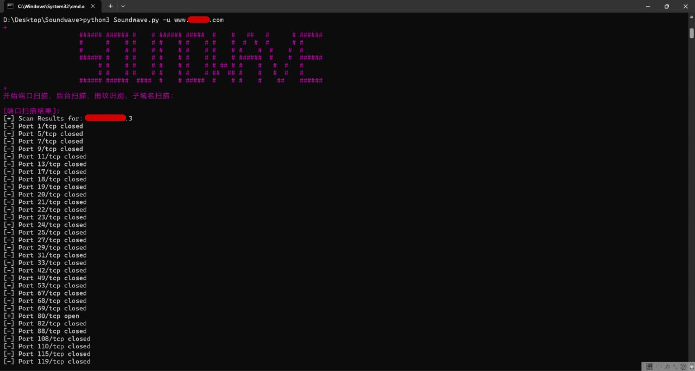

# Soundwave（声波）

## 工具简介：

在进行信息收集的时候，需要进行很多一直重复的很繁琐的操作，这里我把我在使用过程中感觉几个最好用的工具集成了一下。只要输入一个网站，就自动进行端口扫描、指纹识别、后台扫描、子域名扫描并且将每一个扫描出来的子域名再次进行指纹识别和后台扫描

## 集成工具：

- 端口扫描：感觉一般只是扫描web端口也不需要那么多高端的功能，就随便写了一个扫描top1000的
- 指纹识别：使用https://github.com/lemonlove7/EHole_magic
- 后台扫描：使用https://github.com/H4ckForJob/dirmap
- 子域名扫描：使用https://github.com/shmilylty/OneForAll

## 使用方法：

二选一，第一种好像有些电脑上运行不了

方法一：直接在dist目录下Soundwave.exe -u url

方法二：

1. 先把库都下好，用过上面三款工具的可以忽略

2. 把这三个地方改成自己的python命令（python/python2/python3/python3.6之类的）

   

   

3. python Soundwave.py -u url

## 使用截图

（端口扫描后面修改为只显示开放端口，不显示关闭端口）

